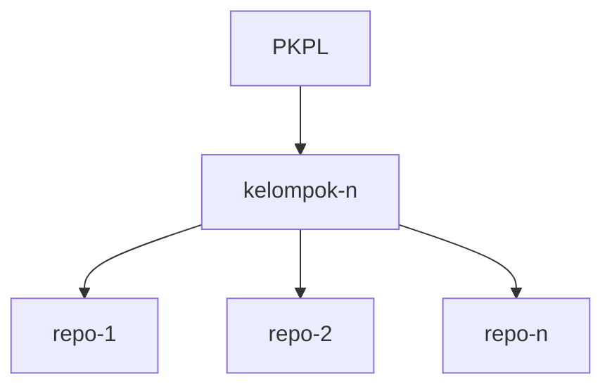
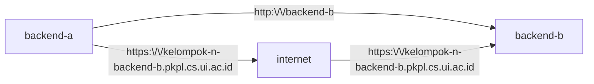

# PKPL Resources and Deployment
## Prepared Resources
In this course, you will get two resources that you can use to deploy your app. That resources are
- Postgres Database
- [Kubernetes](https://kubernetes.io/) Cluster<br>It is an open-source container orchestration platform designed to automate the deployment, scaling, and management of cont

We will provide the CI/CD pipeline and scripts for interacting with Kubernetes Cluster. So you don't need to learn how to use it. For Database, the credentials will be stored in Gitlab CI/CD variables.

### Access
To access these resources manually from your local, you need to connect with UI network such as UI Wifi or local LAN. The other way is you can ssh to kawung ([Request Access Here](https://scele.cs.ui.ac.id/mod/forum/discuss.php?d=22626)) and then create a tunnel with this command
```bash
ssh -L local_port:destination_host:destination_port -i <path-to-key> [-p port] username@ssh_server

# Example
ssh -L 5432:115.115.115.115:5432 -i key.pem -p 2122 user.user@116.116.116.116
```
In Linux and MacOS, you can execute this command in your terminal. For Windows, you can use same command and also PuTTY, docs [here](https://woshub.com/ssh-tunnel-port-forward-windows/).

After you create the connection, you can interact with the resources using localhost address. For example, if we use 5432 as the `local_port`, we can create connection to localhost:5432. 

## Gitlab
You will have dedicated group for creating your repository to develop your application. Your repository name must use kebab-case (snake-case but using dashes). Your repository name will be used in deployment and public domain that will be explained in deployment section later. 
### Diagram

### Pre-defined Variables
In each group, we already set some CI/CD variables such as
| Name        | Description                                                                                      |
| ----------- | ------------------------------------------------------------------------------------------------ |
| KUBECONFIG  | This variable contains config and secrets to access [Kubernetes](https://kubernetes.io/) cluster |
| DB_HOST     | This variable contains the host address of the Postgres Database                                 |
| DB_NAME     | This variable contains the database name                                                         |
| DB_PASSWORD | This variable contains the database password                                                     |
| DB_PORT     | This variable contains the database port                                                         |
| DB_USERNAME | This variable contains the database username                                                      |

## Resource Quotas
| Resource Type | Minimum | Maximum |
| ------------- | ------- | ------- |
| CPU           | 250m    | 1       |
| Memory        | 512Mi   | 1Gi     |
| Service       | 0       | 5       |

If your group has reached the limit, some of your application can't be started. You need to adjust the amount of cpu to match the quotas. For example, if you have 2 repositories, you can split the minimum resources into 125m CPU and 256 Mi Memory. If you have 4 repositories, you can split the minimum resources into 62m CPU and 128 Mi Memory.

## Deployment
### Concept and Services Communication
In this deployment script, each repository will be one [Kubernetes Service](https://kubernetes.io/docs/concepts/services-networking/service/) and have one domain with format like this `<group-name>-<repository-name>.pkpl.cs.ui.ac.id` (ex: kelompok-1-backend.pkpl.cs.ui.ac.id, Group Name : kelompok-1, Repository Name : backend). By default, the domain will have https enabled. Backend and Frontend application can communicate to each other using the generated domain.

If you have multiple services and they want to communicate with each other, you can use domain with format like this `<repository-name>` (ex: http://backend, Repository Name : backend). By using that method, your request will use cluster internal connection. You can still use the generated domain to communicate with each other but the request will go through internet first. You can see the detail in the diagram below

### Requirements
#### 1. Dockerfile
To deploy your application to the Kubernetes Cluster, you need to prepare [Dockerfile](https://docs.docker.com/build/concepts/dockerfile/). This Dockerfile is used to create an Image and The Image is used in creating a container. You can see [Dockerfile](./Dockerfile) in this repository for example.
##### Dockerfile References 
| Tech Stack | Reference                                                                   |
| ---------- | --------------------------------------------------------------------------- |
| Next.js    | https://www.angelospanag.me/blog/containerising-nextjs-using-docker-and-bun |
| Django     | https://www.docker.com/blog/how-to-dockerize-django-app/                    |
| Flask      | https://www.freecodecamp.org/news/how-to-dockerize-a-flask-app/             |
| Go         | https://dev.to/sadeedpv/creating-a-dockerfile-for-your-go-backend-20n5 |

#### 2. CI/CD Files
You need to import `.dockerignore`, `.gitlab-ci.yml`, `.gitlab-ci` folder to your repository. `.gitlab-ci` files and folder are used to trigger Gitlab Pipeline. `.dockerignore` is used to exclude files from current working directory in building the image. If you want to exclude some files when building the image, you can add the file/folder name in that file. 

For Gitlab Pipeline, you don't need to change anything inside `.gitlab-ci.yml` file but you may change some value in `.gitlab-ci` folder. In folder `.gitlab-ci`, there are some CI/CD yaml files configuration :
- `build.yml` : This file is used for building the container image
- `variables.yml` : This file contains variable that used in CI/CD pipelines. There are 3 segments in the file :
   - `App Specifications` : Those variables are used for declaring application resource usage and the port. You can change it based on the application usage and your quota. All the CPU and Memory resources are used custom units. You can read more about resource units in this [documents](https://kubernetes.io/docs/concepts/configuration/manage-resources-containers/#resource-units-in-kubernetes). Below are the explanations of the variables :
       - `MIN_CPU` : Minimum CPU amount to make your application running well
       - `MIN_MEMORY` : Minimum Memory amount to make your application running well
       - `MAX_CPU` : Maximum CPU amount that your application can use
       - `MAX_MEMORY` : Maximum Memory amount that your application can use
       - `PORT` : Your application active port to receive all requests
   - `Image and Deployment Variables` : Those variables are used for deploying your application
   - `App Variables` : Those variables are used for running application. If your application need some variables in the runtime, you can add the variables in this segment. Don't forget to use prefix `PODS_`
- `deploy.yml` : This file is used to deploy the image from build pipeline to Kubernetes Cluster
### Step-by-Step
#### Using Tag
This the default type of deployment. Usually, this type is used after you add some new feature and you want to give a version to your commit. In this type, we recommend your team to use [semantic versioning](https://semver.org/) (ex: v1.0) for the tag name. Below is the step by step :
1. Merge your Code to Default Branch
2. Create git tag, you can do it from Gitlab UI, you can read more in [here](https://docs.gitlab.com/user/project/repository/tags/)
3. After that, you can go to tags page and see the pipeline progress
#### Using Manual Trigger
This type of deployment is used for changing your minimum or maximum resource usage, updating application variables or change deployed application version. If you want to deploy using this type, you can follow this steps:
1. In sidebar choose **Build** -> **Pipelines**
2. In Pipeline page, click **New Pipeline** button in top right corner of the page
3. And after that, you input variable name with `IMAGE_VERSION` and the value is the version tag that you want to use. You can't use new tag to execute this pipeline.


